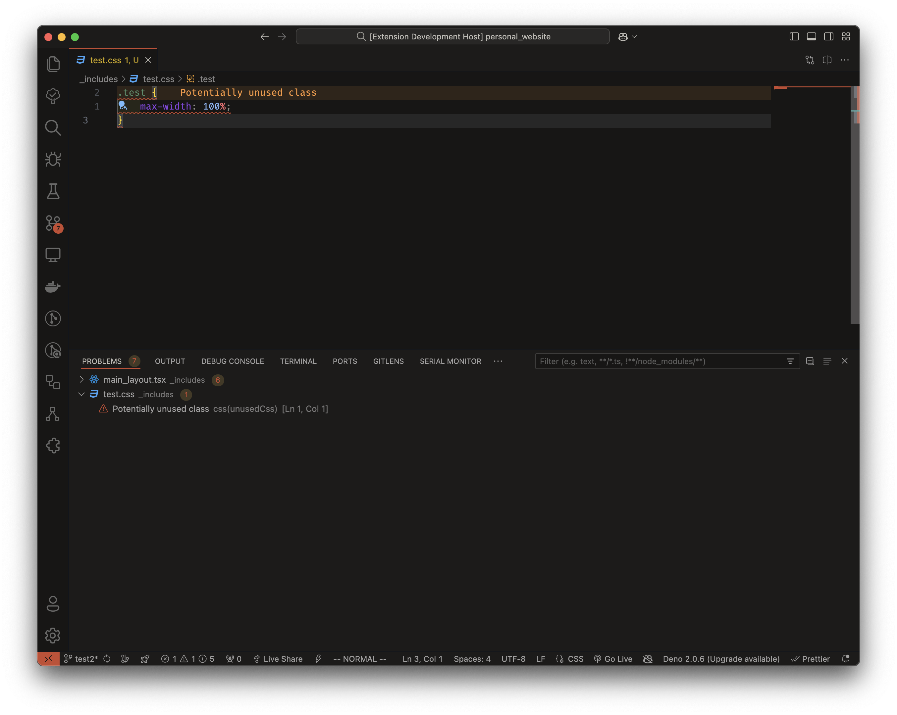
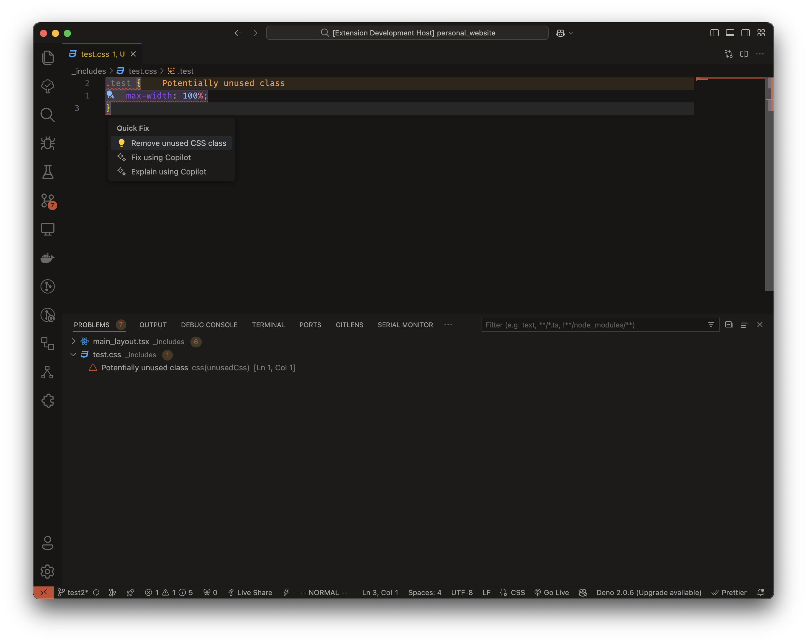

# Unused CSS Finder

Unused CSS Finder is a Visual Studio Code extension that helps you identify and remove unused CSS classes from your project. It scans your files, finds unused CSS, and marks it as a problem directly in the editor.

## Features

- **Automatic Scanning**: Searches for files `.html`, `.jsx`, `.tsx`, `js`, `ts` that could use the currently opened CSS file.
- **Problem Marking**: Identifies unused CSS classes and marks them as problems in VS Code.
- **Supports Various File Types**: Works with `.css`, `.scss`, `.less`, and `.sass` files.

## Screenshots

## How It Works

1. **Scanning for Relevant Files**: The extension looks for files that are in the same folder as currently opened CSS file.
2. **Fallback to Parent Directories**: If no files are found, it searches parent directories up the tree.
2. **Analyzing Usage**: Parses these files to determine which CSS classes are unused.
3. **Marking Unused CSS**: Highlights unused CSS in the editor and lists them in the Problems panel.

## Installation

1. Open Visual Studio Code.
2. Go to the Extensions view by clicking on the Extensions icon in the Activity Bar.
3. Search for `Unused CSS Finder`.
4. Click **Install** to add the extension.
5. Reload VS Code to activate the extension.

## Usage

- Open your CSS file in VS Code.
- The extension automatically scans for unused CSS selectors in the currently opened file.
- Unused selectors are highlighted in your CSS file.
- Review and remove unused CSS to optimize your project.

## Contributing

Contributions are welcome! Please submit issues and pull requests on the [GitHub repository](https://github.com/lczerniawski/Unused-CSS-Finder).

## License

See [LICENSE.txt](LICENSE.txt) for license information.