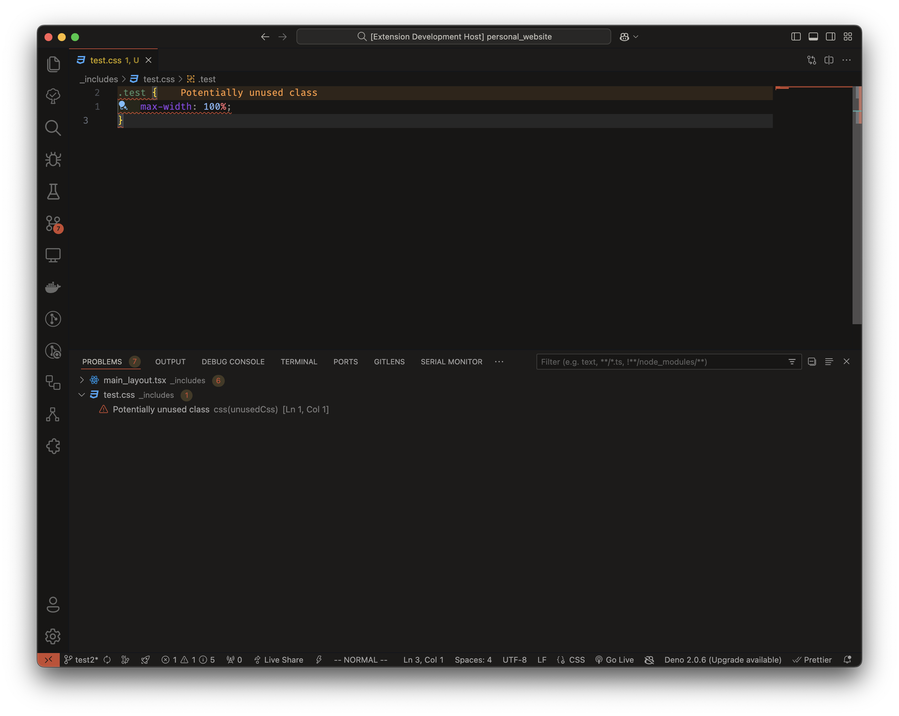
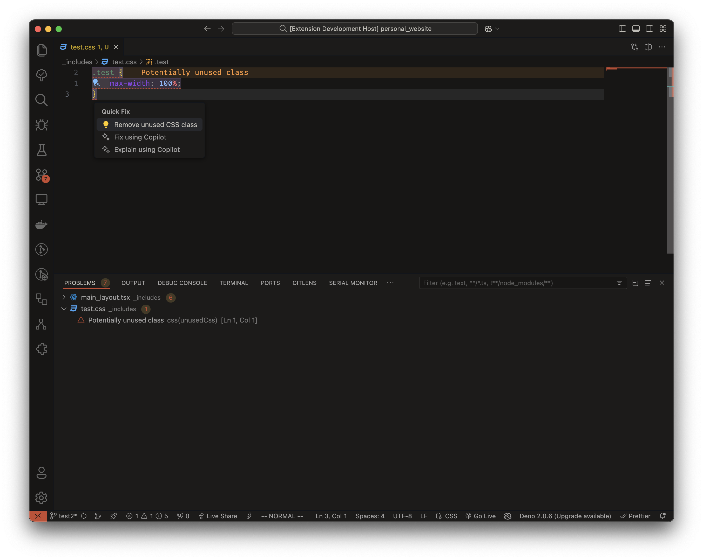

# Unused CSS Finder

Unused CSS Finder is a Visual Studio Code extension that helps you identify and remove unused CSS classes from your project. It scans your files, finds unused CSS, and marks it as a problem directly in the editor.

## Features

- **Automatic Scanning**: Searches for files `.html`, `.jsx`, `.tsx`, `js`, `ts`, `php`, `.vue` that could use the currently opened CSS file.
- **Problem Marking**: Identifies unused CSS classes and marks them as problems in VS Code.
- **Supports Various File Types**: Works with `.css`, `.scss`, `.less`, and `.sass` files.
- **Configurable Fallback Search**: Option to enable/disable fallback search mechanism when no files are found near the CSS file.
- **Child Directory Search**: Option to include child/sibling directories when performing fallback search.
- **Custom Search Paths**: Specify additional directories to always search for CSS usage.

## Screenshots




## How It Works

1. **Scanning for Relevant Files**: The extension looks for files that are in the same folder as currently opened CSS file.
2. **Fallback to Parent Directories**: If no files are found, it searches parent directories up the tree (optionally including their child directories).
3. **Custom Search Paths**: Optionally searches additional specified directories for CSS usage.
4. **Analyzing Usage**: Parses these files to determine which CSS classes are unused.
5. **Marking Unused CSS**: Highlights unused CSS in the editor and lists them in the Problems panel.

## Configuration

The extension provides the following configuration options:

### `unusedCssFinder.enableFallbackSearch`
- **Type**: `boolean`
- **Default**: `true`
- **Description**: Enable fallback search mechanism when no files are found near the CSS file. When enabled, the extension will search parent directories if no relevant files are found in the same directory as the CSS file.

### `unusedCssFinder.includeChildDirectories`
- **Type**: `boolean`
- **Default**: `false`
- **Description**: When fallback search is enabled, also search in child directories of parent folders. This is useful when you have a structure like:
  ```
  parent/
    css/
      styles.css (current file)
    include/
      page.php (will be searched when this option is enabled)
    assets/
      script.js (will be searched when this option is enabled)
  ```

### `unusedCssFinder.additionalSearchPaths`
- **Type**: `array` of strings
- **Default**: `[]`
- **Description**: Additional relative paths (from workspace root) to always search for files that use CSS classes. Useful when you have specific directories that should always be checked regardless of the CSS file location.
- **Example**:
  ```json
  {
    "unusedCssFinder.additionalSearchPaths": ["include", "templates", "src/components"]
  }
  ```

### Example Configuration

To configure these settings:
1. Open VS Code settings (Cmd/Ctrl + ,)
2. Search for "Unused CSS Finder"
3. Adjust the options as needed

Or add them to your `settings.json`:
```json
{
  "unusedCssFinder.enableFallbackSearch": true,
  "unusedCssFinder.includeChildDirectories": true,
  "unusedCssFinder.additionalSearchPaths": ["include", "templates"]
}
```

## Installation

1. Open Visual Studio Code.
2. Go to the Extensions view by clicking on the Extensions icon in the Activity Bar.
3. Search for `Unused CSS Finder`.
4. Click **Install** to add the extension.
5. Reload VS Code to activate the extension.

## Usage

- Open your CSS file in VS Code.
- The extension automatically scans for unused CSS selectors in the currently opened file.
- Unused selectors are highlighted in your CSS file.
- Review and remove unused CSS to optimize your project.

## Contributing

Contributions are welcome! Please submit issues and pull requests on the [GitHub repository](https://github.com/lczerniawski/Unused-CSS-Finder).

## License

See [LICENSE.txt](LICENSE.txt) for license information.